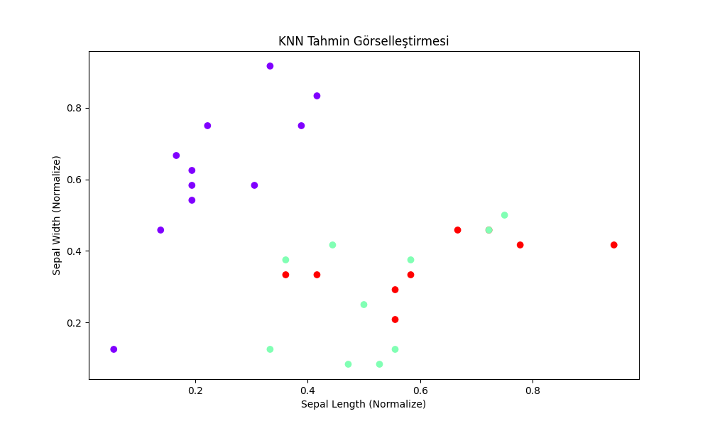

# 🤖 Sıfırdan KNN Algoritması (ML from Scratch)

Bu proje, popüler makine öğrenmesi kütüphanelerini (Scikit-Learn vb.) kullanmadan, sadece **NumPy** ve temel matematiksel formüllerle bir **K-Nearest Neighbors (KNN)** modelinin nasıl inşa edileceğini göstermektedir.

## 🚀 Başarı Hikayesi: %45'ten %96'ya!
Projenin geliştirilme sürecinde karşılaşılan zorluklar ve uygulanan çözümler:
- **Sorun:** İlk denemelerde model başarısı **%45** seviyelerinde kaldı.
- **Analiz:** Verilerin ölçeklendirilmediği  ve özellikler arasındaki mesafe farklarının modeli yanılttığı fark edildi.
- **Çözüm:** - **Min-Max Scaling** uygulanarak tüm veriler 0-1 arasına çekildi.
    - **K değeri 5** olarak optimize edildi.
    - Veri seti güvenli bir şekilde karıştırıldı (Shuffling).
- **Sonuç:** Iris veri seti üzerinde **%96.67** doğruluk (accuracy) oranına ulaşıldı.

## 🛠 Kullanılan Teknikler
- **Öklid Mesafesi (Euclidean Distance):** İki veri noktası arasındaki kuş uçuşu mesafeyi hesaplamak için kullanıldı.
- **Çoğunluk Oylaması (Majority Voting):** En yakın K komşunun etiketlerine göre karar verme mekanizması kuruldu.
- **Veri Ön İşleme:** NumPy ile normalizasyon işlemleri yapıldı.

  

